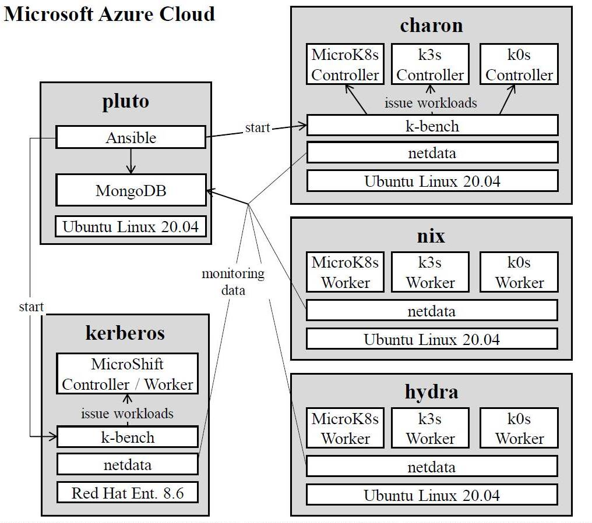

# Lightweight K8s Distribution Benchmarking

## Overview
This repository provides measurements and data from several experiments benchmarking the lightweight Kubernetes distributions MicroK8s, k3s, k0s, and MicroShift. A full report on these experiments is submitted as a research paper for peer review. The repository covers:
- ansible-playbooks: for starting the K8s distributions and initiating k-bench experiments
- experiment-data: raw data captured in  experiments (e.g., CPU utilizations, throughputs)
- k-bench: the configuration files for setting up the benchmarking tool k-bench
- netdata-conf: the configuration of the monitoring tool netdata 
- r-scripts: various scripts to process and visualize the raw data

Replicating the full experiment setup requires five Microsoft Azure VMs, as described [further below](#full-experiment-setup). To get a minimal test running locally, we also [decribe a minimal experiment setup](#minimal-experiment-setup) on a single Linux node for initial testing, or checking the k-bench configurations. Notice that neither the k8s distributions, nor the benchmarking tool k-bench have be developed by us, this repository merely provides the configurations to carry out different performance experiments with the existing software.

## Minimal Experiment Setup
You need a Linux host (tested with Ubuntu 20.04), install k3s, install k-bench, and then run k-bench, which takes overall around 10 min. First install k3s (approx. 3 min):

````
curl -sfL https://get.k3s.io | sh -

# Configure k3s for K-Bench:
mkdir ~/.kube
sudo cp /etc/rancher/k3s/k3s.yaml ~/.kube/config
cd ~/.kube
sudo chown <your username>:<your group> config
chmod 664 config
````
Check for running Kubernetes cluster:
````
sudo kubectl get nodes
````
If your node is ready, then install [k-bench](https://github.com/vmware-tanzu/k-bench) (approx. 5 min) and start the default benchmark configuration (approx. 2 min):
````
git clone https://github.com/vmware-tanzu/k-bench.git
cd k-bench
sudo ./install.sh
````
If the installation fails, try re-running it and answering all questions prompted with 'Y' for yes. If that still does not work, try install a newer version of Go, e.g., Go 1.18.1 as per [these instructions](https://www.cyberciti.biz/faq/how-to-install-gol-ang-on-ubuntu-linux/). After installation success, you can invoke the benchmark as follow:
````
kbench
````
Wait for the benchmark run to complete. You can then inspect the file "kbench.log" created in the same directory for benchmark results. The different metrics that are included in this file are explained on the [K-bench website](https://github.com/vmware-tanzu/k-bench). You can then try our [K-bench configurations](k-bench/Readme.md) by running:
````
kbench -benchconfig <desired filepath>
````

## Full Experiment Setup
We executed the experiments on five Microsoft Azure VMs (”Standard_D2s_v3” VMs, Ubuntu 20.04,  with Intel Xeon E5- 2673 v3 CPUs at 2.4 GHz, 2 cores and 8 GB RAM each, all in location “West Europe”). To replicate the experiments exactly, the same kind of VMs needs to be created in an [Azure Developer account](https://portal.azure.com/#home).

<p style="text-align:center;"></p>

For [MicroShift](https://microshift.io/), there are no installation packages available for Ubuntu yet, so we used the recommended Red Hat Enterprise Linux 8.6 OS and [installed](https://microshift.io/docs/getting-started/) MicroShift via RPM packages. Furthermore, MicroShift cannot yet operate in a multi-node cluster, so we performed all MicroShift measurements only on a single node (’kerberos’). The node ’pluto’ served as the experiment coordinator and executed Ansible playbooks to install the K8s distributions and execute the experiments. ’charon’ served as K8s controller for MicroK8s, k3s, and k0s, while ’nix’ and ’hydra’ served as workers. 

For data collection, we selected [netdata](https://www.netdata.cloud/), an OSS Linux daemon to monitor various metrics (e.g., CPU and memory usage), because it incurs a low CPU overhead of only about 2 percent. We compiled netdata from source to enable an [exporting module for MongoDB](https://learn.netdata.cloud/docs/agent/exporting/mongodb), which we hosted on the ’pluto’ node separate from K8s cluster nodes to avoid experiment interferences. We configured netdata to sample the system metrics every 5 seconds on each VM. To retrieve the metrics from MongoDB, we used the mongolite package for the R-programming language and visualized the metrics using the ggplot2 package inside RStudio.

To replicate the experiments you need to install MongoDB, Netdata, K-Bench, R, and any K8s distribution of interest. First install [MongoDB](https://www.mongodb.com/docs/manual/tutorial/install-mongodb-on-ubuntu/):

````
wget -qO - https://www.mongodb.org/static/pgp/server-6.0.asc | sudo apt-key add -
echo "deb [ arch=amd64,arm64 ] https://repo.mongodb.org/apt/ubuntu focal/mongodb-org/6.0 multiverse" | sudo tee /etc/apt/sources.list.d/mongodb-org-6.0.list
sudo apt-get update
sudo apt-get install -y mongodb-org libmongoc-1.0-0 libmongoc-dev libbson-dev libbson-1.0-0 
sudo systemctl start mongod
````
Then [build Netdata](https://learn.netdata.cloud/docs/agent/packaging/installer/methods/source) from source (required to activate the MongoDB exporter):
````
curl -Ss 'https://raw.githubusercontent.com/netdata/netdata/master/packaging/installer/install-required-packages.sh' >/tmp/install-required-packages.sh && bash /tmp/install-required-packages.sh -i netdata
git clone https://github.com/netdata/netdata.git --depth=100 --recursive
cd netdata
sudo ./netdata-installer.sh  # takes a while...
````
And configure Netdata for MongoDB exporting:
````
cd /etc/netdata
./edit-config exporting.conf
````
Edit the file to look like so:
````
[exporting:global]
    enabled = yes
    # send configured labels = yes
    # send automatic labels = no
    # update every = 5

# [...]

[mongodb:mongodb-connector]
    enabled = yes
    destination = mongodb://localhost
    database = netdata
    collection = netdata_collection
    # data source = average
    # prefix = netdata
    # hostname = my_hostname
    # update every = 10
    # buffer on failures = 10
    # timeout ms = 20000
    # send names instead of ids = yes
    # send charts matching = *
    # send hosts matching = localhost *
````
If you are not running mongodb on the localhost, then adjust the hostname accordingly, and also add username and password (also see [MongoDB Connection String](https://www.mongodb.com/docs/manual/reference/connection-string/)). Then restart netdata and check if the exporting is enabled:
````
sudo systemctl restart netdata
grep EXPORTING /var/log/netdata/error.log
````
You can check in MongoDB if the netdata is actually exporting values:
````
mongosh
show dbs
use netdata
db.netdata_collection.find()
````

Now it is time to install a k8s distribution, e.g., k3s:

````
curl -sfL https://get.k3s.io | sh -

# Configure k3s for K-Bench:
mkdir ~/.kube
sudo cp /etc/rancher/k3s/k3s.yaml ~/.kube/config
cd ~/.kube
sudo chown <your username>:<your group> config
chmod 664 config
````
Check for running Kubernetes cluster:
````
sudo kubectl get nodes
````
If your node is ready, then install k-bench and start the default benchmark configuration:
````
git clone https://github.com/vmware-tanzu/k-bench.git
cd k-bench
sudo ./install.sh
````
You can then try our [K-bench configurations](k-bench/Readme.md) by running the following, replacing \<filepath\> with the folder of the desired benchmark configuration:
````
kbench -benchconfig <desired filepath>
````

After editing our [ansible playbooks](ansible-playbooks) changing all "TODOs" to your local settings and editing the inventory file to your IP adresses, you can also run these *on the experiment coordinator node* (e.g., pluto) to start experiments:
````
sudo apt install python3-pip
python3 -m pip install --user ansible
ansible --version
ansible-galaxy collection install community.mongodb
cd ansible-playbooks
ansible-playbook -i inventory experiment-idle.yml
ansible-playbook -i inventory experiment-kbench.yml
````

The playbooks require the ansible collection community.mongodb, since they write timestamps for the experiments into MongoDB, which are then used by R-scripts to query the database for the data of a specific experiment. If you want to use our r-scripts for statistics/visualization, then [install R](https://cran.r-project.org/bin/linux/ubuntu/fullREADME.html):
````
sudo apt install --no-install-recommends software-properties-common dirmngr
wget -qO- https://cloud.r-project.org/bin/linux/ubuntu/marutter_pubkey.asc | sudo tee -a /etc/apt/trusted.gpg.d/cran_ubuntu_key.asc
sudo add-apt-repository "deb https://cloud.r-project.org/bin/linux/ubuntu $(lsb_release -cs)-cran40/"
sudo apt install --no-install-recommends r-base
````
And perhaps add [R-Studio](https://posit.co/download/rstudio-desktop/):
````
wget https://download1.rstudio.org/desktop/bionic/amd64/rstudio-2022.07.1-554-amd64.deb
sudo apt install -f rstudio-2022.07.1-554-amd64.deb
````

## K8s Distribution Installations

You can use the following instructions to set up minimal installations of the different k8s distributions. Multi-node setups require generating a token in the controller node and using this token to onboard the worker nodes. Check the documentation of each distribution for more details.

[MicroK8s](https://microk8s.io/#install-microk8s):
````
sudo snap install microk8s --classic
microk8s status --wait-ready
````
To onboard additional worker nodes, refer to the [MicroK8s documentation](https://microk8s.io/docs/clustering).

[k3s](https://docs.k3s.io/quick-start):
````
curl -sfL https://get.k3s.io | sh -
````
To onboard additional worker nodes, refer to the [k3s documentation](https://docs.k3s.io/quick-start).


[k0s](https://docs.k0sproject.io/v1.21.2+k0s.0/install/):
````
curl -sSLf https://get.k0s.sh | sudo sh
sudo k0s install controller --single
sudo k0s start
````
To onboard additional worker nodes, refer to the [k0s documentation](https://docs.k0sproject.io/v1.26.0+k0s.0/k0s-multi-node/).

[MicroShift](https://microshift.io/docs/getting-started/) (needs RHEL 8.6)
````
command -v subscription-manager &> /dev/null && subscription-manager repos --enable rhocp-4.8-for-rhel-8-x86_64-rpms
sudo dnf install -y cri-o cri-tools
sudo systemctl enable crio --now

sudo dnf copr enable -y @redhat-et/microshift
sudo dnf install -y microshift

sudo firewall-cmd --zone=trusted --add-source=10.42.0.0/16 --permanent
sudo firewall-cmd --zone=public --add-port=80/tcp --permanent
sudo firewall-cmd --zone=public --add-port=443/tcp --permanent
sudo firewall-cmd --zone=public --add-port=5353/udp --permanent
sudo firewall-cmd --reload
sudo systemctl enable microshift --now

# Install clients
curl -O https://mirror.openshift.com/pub/openshift-v4/$(uname -m)/clients/ocp/stable/openshift-client-linux.tar.gz
sudo tar -xf openshift-client-linux.tar.gz -C /usr/local/bin oc kubectl
mkdir ~/.kube
sudo cat /var/lib/microshift/resources/kubeadmin/kubeconfig > ~/.kube/config
oc get pods -A
````